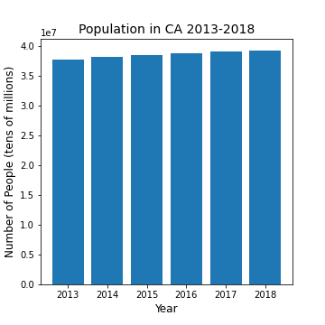
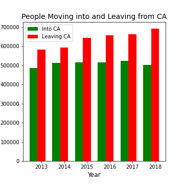
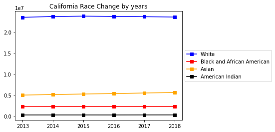
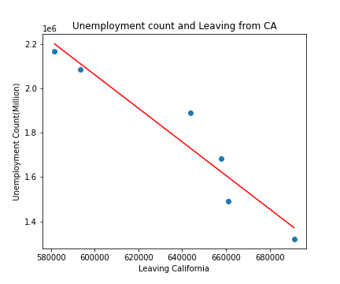
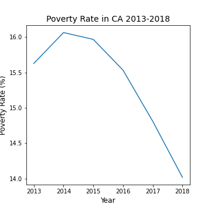
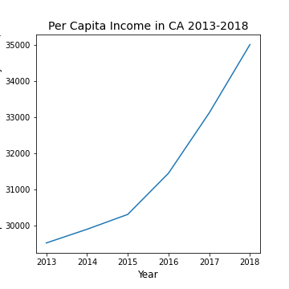
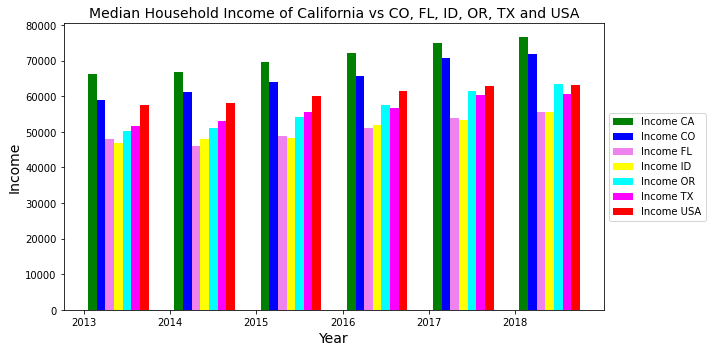
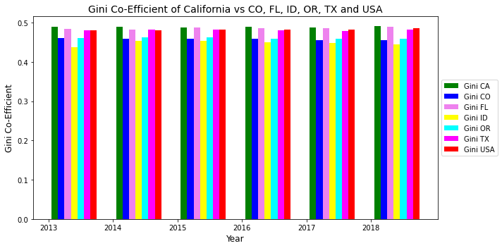

# **Californians on the Move**

## **Project Description and Scope**

More Californians are leaving the state than migrating into the state. 

Following these data points, we set out to prove this statement:

* increased poverty levels
* increased population 
* Transportation/traffic congestion (time to/from work)
* unemployment rates
* reduced incomes (per capita income levels)
* higher income inequality
* higher housing costs 
* higher taxes 

Population Scope Baseline: California

Population Competitive View: Colorado, Florida, Idaho, Oregon, Texas

5 states chosen based on migration data and supporting articles of top states Californians moving to
Time Frame: 5 year time frame 2013-2018

## **Team and Contributions**

* **Jenifer Hwang**: Project manager, Results discussion, Mining data and script/analysis for Population, Migration and Poverty.

* **Daniel Kim**: Mining data and script/analysis Mining data for Unemployment, Demographics (i.e., race).

* **Natalia Karimova**: Results discussion, ReadMe.md file, Script for collecting data from Census into one DataFrame (jupyter notbook script), VBA script to pull migration data together from Census Excel files, put all analysis-scripts together in one final script, Mining data and script/analysis for Rent and Housing.

* **Hossein Esteaneh**: Results discussion, Mining data and script/analysis for Transportation/Traffic Congestion.

* **Sara McLean**: Results discussion, Generating the Proposal and Final PowerPoint Presentation, Mining data and script/analysis for Household Income, Gini Co-efficient.

## **Data Set and Supporting Information**

* Transportation; Population; Incomes; Housing Costs; Taxation; Populations

    * api.census.gov/

* State-to-state migration Tables (Census): 

    * https://www.census.gov/data/tables/time-series/demo/geographic-mobility/state-to-state-migration.html

* Supporting Information:

    * https://www.economy.com/united-states/net-migration

    * https://www.nytimes.com/2020/01/09/upshot/american-population-slowdown.html

    * https://www.prb.org/usdata/indicator/migration/map/state/2010/ 

    * https://www.census.gov/library/stories/2019/04/moves-from-south-west-dominate-recent-migration-flows.html

    * https://www.ocregister.com/2019/10/31/190122-more-people-left-california-last-year-vs-arrived-a-38-jump/

    * https://showmehome.com/unpacking-californias-migration-trends/ 

    * https://www.ppic.org/press-release/whos-movin-out-of-california/ 	

    * https://www.latimes.com/california/story/2019-12-21/california-population-continues-to-decline-with-state-emigration-a-major-factor

    * https://next10.org/sites/default/files/California-Migration-Final2.pdf

## **Scripts**

* `vba_for_migration.vb` - VBA script to collect migration data from the state-to-state migration Tables (Census) for selected year. Final DataFrame with migration data over 6 years (2013-2018) can be found in here (Data/Total_Migration_2013-2018_CSV.csv).

* `data_collection.ipynb` - jupyter notebook script to collect Cencus api data and merge results with with Total_Migration_2013-2018_CSV.csv dataframe. The final DataFrame used for further analysis  is Data/all_census_data.csv 

* `final_script.ipynb` - final script for analysis collected data.

## **Data files desctiption**:

* Data/Total_Migration_2013-2018_CSV.csv - migration data for all 52 states 
   * `move_in` - number people moved into the specific state this year
   * `move_out` - number people moved out from the specific state this year
   * `Delta` = (`move_in` - `move_out`). For excample, CA has negative delta that means that more people move out of this state that moved in. 

* Data/all_census_data.csv - final DataFrame used for analysis for CA, FL, OR, CO, ID, TX (2013-2018 years):

   * `Year` - 2013, 2014, 2015, 2016, 2016, 2017, 2018
   * `State Name` - California, Florida, Oregon, Colorado, Idaho, Texas
   * `Population` - total population in the state
   * `Per Capita Income` - per capita income in the past 12 months 
   * `Poverty Count` - Income in the past 12 months below poverty level
   * `Rent(%)` -  Median Rent as a Percentage of Houshold Income (%)
   * `House with mortgage(%)` -  Median Owner Cost for House WITH Mortgage as a Percentage of Houshold Income (%)
   * `House without mortgage(%)` -  Median Owner Cost for House WITHOUT Mortgage as a Percentage of Houshold Income (%)
   * `Mean of Trans by Age` - Means of transportation to work by age (Total in minutes)
   * `Travel Time to Work` - Travel time to work (Total in minutes)
   * `Race Total` - population of the state
   * `White alone` - number of White people in the state
   * `Block or African American alone` - number of African American people in the state
   * `American Indian and Alaska Native Alone` - number of Indian and Alaska Native people in the state
   * `Asian Alone` - number of Asian people in the state
   * `Unemployement count` - number of Unemployed people in the state
   * `Poverty Rate` = (`Poverty Count` / `Population`)*100
   * `move_in` - number people moved into the specific state this year
   * `move_out` - number people moved out from the specific state this year
   * `Delta` = (`move_in` - `move_out`) 

## **Results and Discussions**:

### **I. Population and Migration Findings**

 

* Even though, population in the overall state has been increasing, more people over the years have been moving out of CA.

### **II. Population and Demographics**

 

* From 2013 to 2018 there are no significant change on demographics. Only Asian population is  moderately increased compare to other races.

* We found that growth of Asian population seems the reason of growing California’s population.

### **III. Population and Unemployment Findings**

* California unemployment count is decreasing by years. 
* Based on census data, California’s unemployment count declines more than other states. 

 

* California population is growing.

* Count of leaving California is growing.

* Unemployment count is decreasing.

* We found that population and unemployment count indicate a negative correlation.

* Therefore, we conclude that unemployment is not the reason of people leaving California.

### **IV. Transportation/Traffic Congestion (travel time to & from work)**

 

* Travel time to work could be one of the reason people are leaving California compare with other five states. 

* In these graphs we can see that people spend more time to travel to work instead of being with their family.

* Texas and Florida have more travel time to work after California, and Idaho is the lowest. 

* In this pie graph we could see people in California spend the most travel time to work and Idaho with the lowest .

### **V. Poverty Rate and Per Capita Income Findings**

* Poverty Rate has been decreasing over the years but it could be indicator of change in inflation.

* Per Capita Income is used to evaluate the standard of living and quality of life. It is calculated by Income divided by Population. 
* Even though the Per Capita Income is increasing it does not necessarily mean that the standard of living is increasing as well. 
* The Per Capita Income does not take into account inflation changes over the years. The Census calculated these numbers using the 2017 inflation adjusted numbers.

### **VI. Household Income, ACS Gini co-efficient and State Tax Data**

* Median household income from US Census highlights that California leads in income among the 5 competing states and US average
California shows higher incomes compared to USA average and 5 competing states over 5 year data span.

* ACS Gini co-efficient: measure of income inequality calculated by US Census:
      * 0: closer to zero (0) represents perfect equality
      * 1: closer to one(1) represents perfect inequality

* California show higher income inequality than 5 competing states and USA average
While California shows higher incomes over 5 competing states, there is higher income inequality among the population compared to 5 competing states and USA average

* State Tax Data: represents %  state tax households pay within CA and 5 competing states.
* California pays higher state taxes than 5 competing states.
* While California has higher incomes,  more goes to taxes than other states.

### **VII. Migration vs Rent & Housing**

 

* Both California and Florida have higher rent. 

* California is the most expensive state to buy a house with mortgage.

* The most attractive states to have property is ID, TX and CO.

* There is a weak positive correlation between migration out of CA and housing prices (r-value = 0.45). So, there are additional more valuable reasons why people prefer to move out from CA.

## **Summary and Conclusions**

* General Conclusions and What Findings Mean:

   * The information gathered from the US Census confirms our hypothesis that money inequality, expensive housing and traffic congestion are a few of many factors that are leading Californians to leave the state.

* Implications: 

   * These are not the only factors beyond those covered in the US Census that are reasons why people may be leaving.
      
* Difficulties:
   
   * We faced difficulties in using some of the US Census API data as it wouldn’t always lead where we needed for information. Many hours were needed to locate some of the necessary data used for the project.

* Additional Questions:
   
   * We would include more states and more years if we had more time. We would also look to add more variables into the data set including immigration data into California, birth rates, climate change including fire disasters, education expenses, other deciding factors for leaving California.

